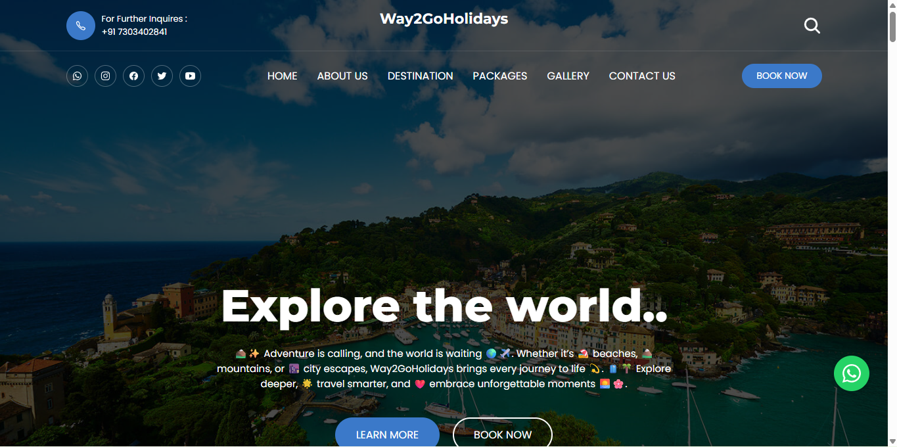

<div align="center">
  

  

  <br />
  <br />
  <figure alt="Desktop img">
  
  </figure>

  <h2 align="center">Way2GoHolidays - Travel website</h2>

  Way2GoHolidays is fully responsive travel website, <br />Responsive for all devices, built using HTML, CSS, and JavaScript.

  <a href="https://way2goholidays.vercel.app"><strong>➥ Live Demo</strong></a>

</div>

<br />

### Demo Screeshots


### Prerequisites

Before you begin, ensure you have met the following requirements:

* [Git](https://git-scm.com/downloads "Download Git") must be installed on your operating system.

### Run Locally

To run **Way2GoHolidays** locally, run this command on your git bash:

Linux and macOS:

```bash
sudo git clone https://github.com/Vivekmandal07/Way2GoHolidays.git
```

Windows:

```bash
git clone https://github.com/Vivekmandal07/Way2GoHolidays.git
```

### Contact

If you want to contact with me you can reach me at [Twitter](https://www.twitter.com/).

### License

This project is **free to use** and does not contains any license.
